# The Oregon Trail — Wear OS

A native Kotlin reimplementation of *The Oregon Trail* (1985, Apple II), built for the
round screen and rotating crown of a Wear OS watch. Not an emulator — every screen,
control, and pixel-art asset here is original, hand-fit to a 1.2" circular display.

**[Play it in a browser →](https://webrender.net/oregon-trail-wear-os/)**

It also runs on the web, compiled to WebAssembly. Same code, same 192dp round screen,
magnified and set in a bezel — the mouse wheel turns the crown, and the arrow keys steer
the raft. See [ADR 0007](docs/adr/0007-web-port.md) for why it simulates the watch rather
than reflowing for a window.

Personal project, built for and tested on a Pixel Watch 2. Sideload-only; not published
to the Play Store (see [ADR 0002](docs/adr/0002-sideload-only-distribution.md)).

## Screenshots

All captured on the `Wear_OS_Large_Round` emulator (454×454, API 33).

| | |
|---|---|
| 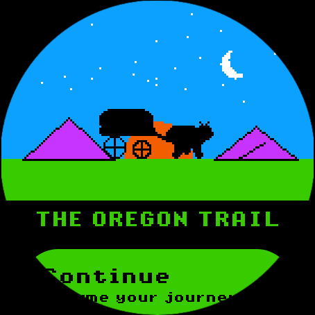 | 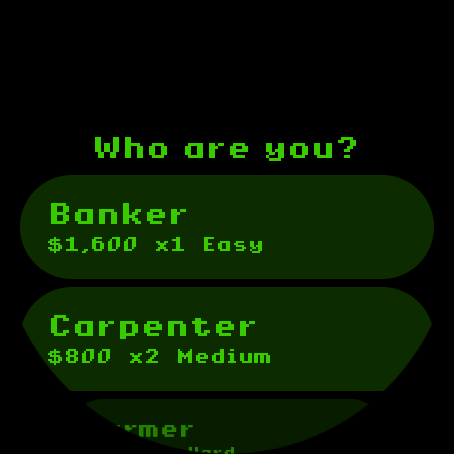 |
| Title screen | Choosing a profession |
| 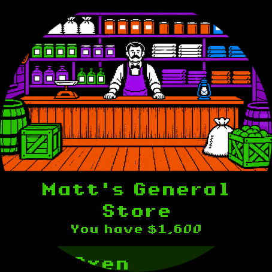 | 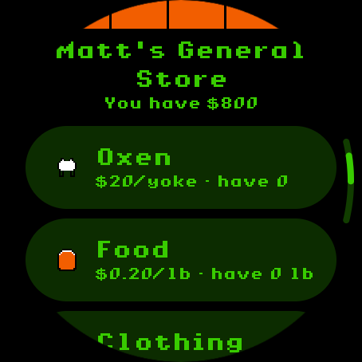 |
| The general store | Store goods list |
| 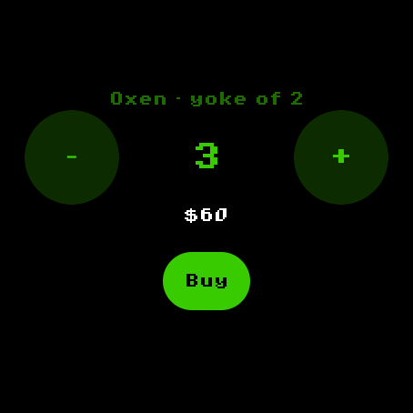 | 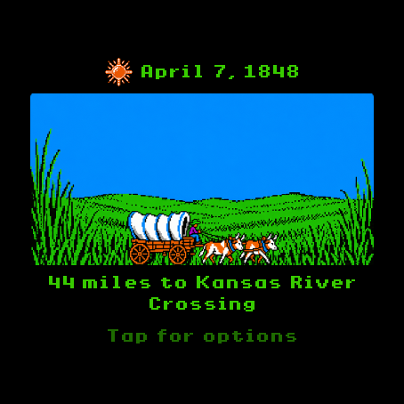 |
| Quantity stepper for purchases | On the trail |
| 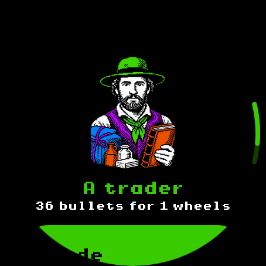 | 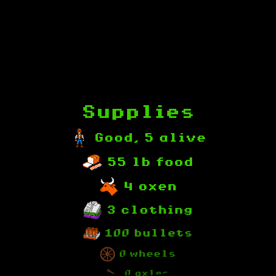 |
| A trail encounter | Checking supplies |
| 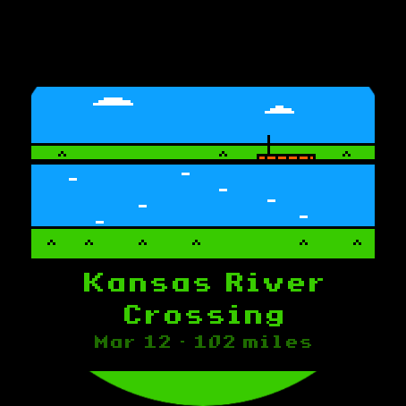 | 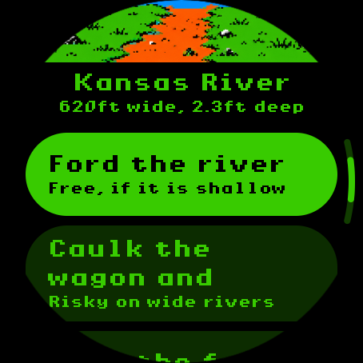 |
| Arriving at a river | Choosing how to cross |
| 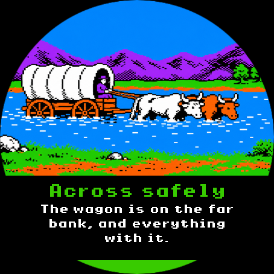 | 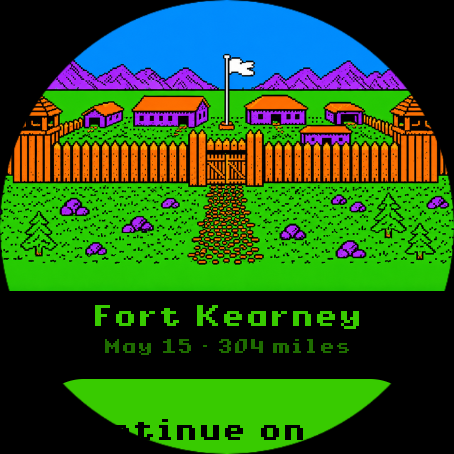 |
| Fording safely | Arriving at a fort |
| 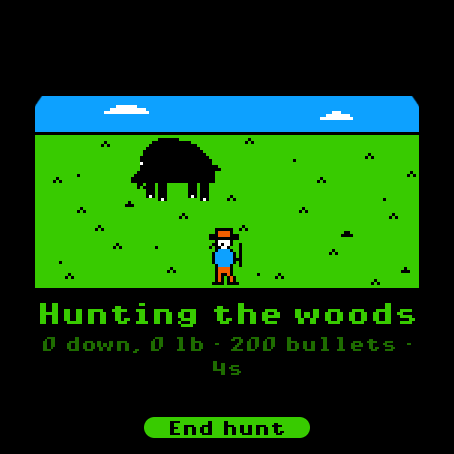 | 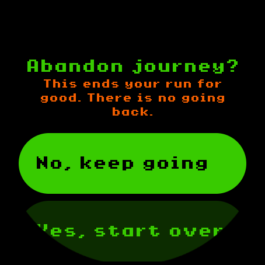 |
| Hunting the prairie | Abandoning a run (no undo) |
| 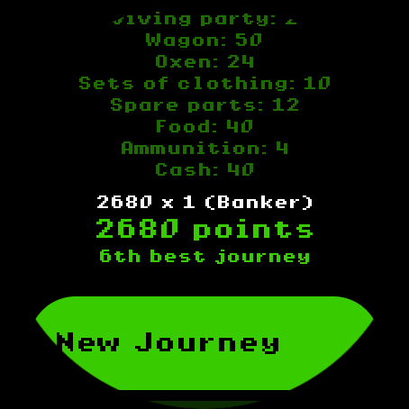 | 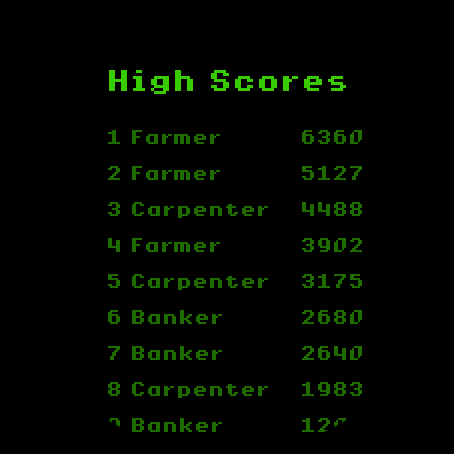 |
| Scoring a finished journey | The ten best journeys |

## Design

- **The crown is the primary control.** Rotating it moves the selection in a list;
  tapping confirms; swiping right goes back. Nothing else is overloaded.
- **No free text anywhere.** Party names come from a curated period-appropriate list,
  hunting is aim-and-fire with the crown and a tap, and every decision — pace, rations,
  river crossings, purchases — is a picker or a stepper, never a keyboard.
- **Pixel art**, reminiscent of Apple II composite-NTSC rendering but drawn from
  scratch — no original MECC art is used or referenced pixel-for-pixel. See
  [`docs/art-brief.md`](docs/art-brief.md) for the style guide and asset pipeline.
- **UI text is set in Shaston**, the Apple IIGS system font, vendored under its free-use
  licence (see [`NOTICE.md`](NOTICE.md)).

The `docs/adr/` folder records the bigger decisions, including why this became a native
reimplementation instead of an Apple II emulator running the original 1985 disk image
([ADR 0005](docs/adr/0005-native-reimplementation.md)) — in short, the original expects
a keyboard, and no gesture scheme made typing tolerable on a watch.

## Building

Requires the Android SDK and a JDK 17 toolchain (Android Studio's bundled JBR works).

**The watch:**

```
./gradlew :app:assembleDebug
adb install -r app/build/outputs/apk/debug/app-debug.apk
```

Minimum SDK is Wear OS 4 / API 33 (what the Pixel Watch 2 ships). There's no native
code and no NDK dependency, so the build is a plain Gradle/Kotlin/Compose project.

**The browser:**

```
./gradlew :shared:wasmJsBrowserDistribution
scripts/serve-web.sh
```

That writes a self-contained static site to
`shared/build/dist/wasmJs/productionExecutable` — the wasm, its loader, and the art —
which can be dropped on any static host. It has to be served over HTTP rather than opened
from disk: a `file://` page can neither instantiate WebAssembly nor fetch the art, and the
failure looks like a game that loads and then draws nothing.

`.github/workflows/pages.yml` does exactly that on every push to `master` and publishes
the result to GitHub Pages. Add `?debug=1` to the URL for the jump-to-any-landmark menu
the debug APK has.

## Testing

The game engine (`core/`) is pure Kotlin with no platform dependencies, so it's covered
by JVM unit tests with no emulator and no browser needed. They live in the Android
target's unit tests because that is the only target here with a JVM to run them on:

```
./gradlew :shared:testDebugUnitTest
```

Three of them guard failures that are otherwise completely silent — `ArtNamesTest` (an
asset name that resolves to nothing draws nothing), `MapLabelTest` (a label too wide is
cropped by the bezel, with no ellipsis to say so), and `FontCoverageTest` (a character
Shaston lacks is quietly drawn in the system font on Android, and not at all in a
browser).

## Architecture

Two Gradle modules. `:shared` is the game, built for both targets; `:app` is an activity,
a manifest, and a launcher icon.

- `shared/src/commonMain` — everything: the engine, the controller, the art renderer, and
  all twenty-four screens.
  - `core/` — trail state, the turn loop, the store, hunting, river crossings, scoring,
    RNG. Plain Kotlin, unaware there is a platform at all.
  - `ui/` — Compose. `Screen.kt` is a small sealed navigation graph; `GameController`
    drives it from `core`'s state and handles save/resume.
  - `ui/art/` — the art renderer.
  - `ui/components/Widgets.kt` — the eight `expect` declarations that are the whole of the
    platform seam, and the reason the screens above them are written once.
- `shared/src/androidMain` — Wear Compose, `BitmapFactory`, files, and the art and font
  assets both targets read.
- `shared/src/wasmJsMain` — the same widgets redrawn, art over `fetch`, saves in
  `localStorage`, and the bezel the watch is set in.

## Status

A personal project, not affiliated with or endorsed by MECC or its successors.
